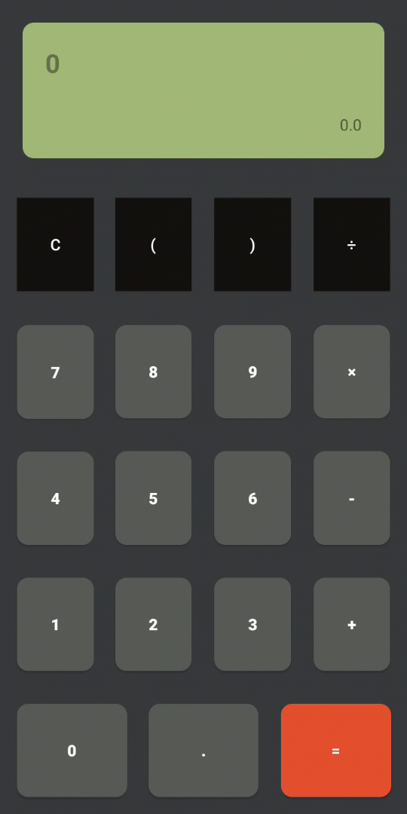

# AdvancedCalculator
Advanced Android calculator using Shunting-yard algorithm &amp; Kotlin language

## Branches :
 - Starter code for Youtube Tutorial : [starter_code](https://github.com/ixiDev/AdvancedCalculator/tree/starter_code)
 - Tutorial 2 episode code : [tutorial_episode_2](https://github.com/ixiDev/AdvancedCalculator/tree/tutorial_episode_2)
 - Tutorial 3 episode code : [tutorial_episode_3](https://github.com/ixiDev/AdvancedCalculator/tree/tutorial_episode_3)
 - Java version : [java](https://github.com/ixiDev/AdvancedCalculator/tree/java)
 
 
## Screenshots 🎉

    

## Tutorial
### 1 - Definition :

    

### 2 - How algorithm works :

    

You can follow tutorial videos on youtube link :
https://www.youtube.com/playlist?list=PL7hEgwbTA5Aoj0EswHtSkvcVg3PI6d3pz
