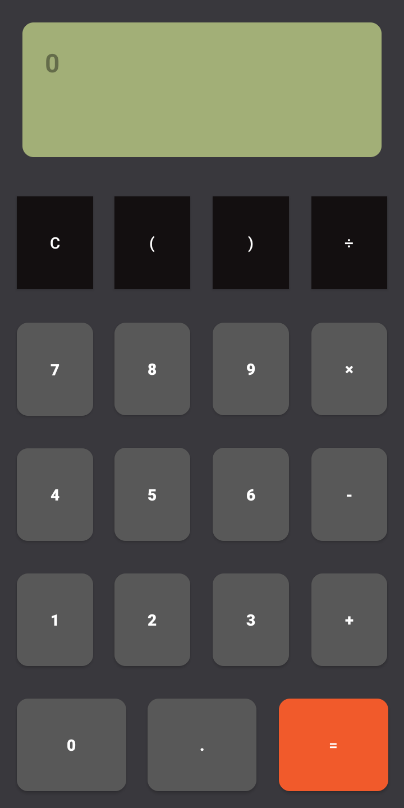

# AdvancedCalculator
Advanced Android calculator using Shunting-yard algorithm &amp; Kotlin language

## Screenshots 🎉

    

## Tutorial
You can follow tutorial videos on youtube link :
https://www.youtube.com/playlist?list=PL7hEgwbTA5Aoj0EswHtSkvcVg3PI6d3pz
